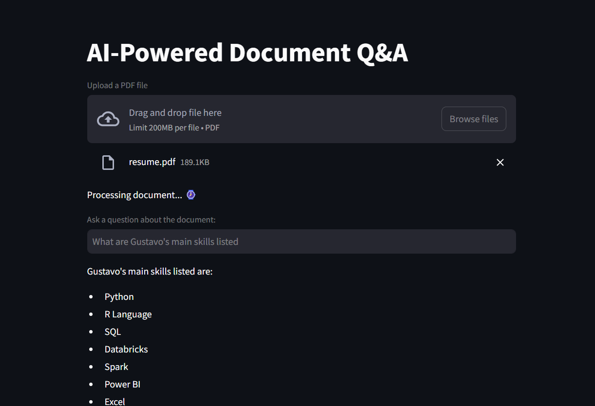

# AI-Powered Document Q&A


This is a Streamlit application that allows users to upload a PDF document and ask questions about its content using AI-powered natural language processing (NLP) tools. The app uses Langchain, OpenAI's GPT-4 model, and FAISS (Facebook AI Similarity Search) for document retrieval and question answering.

## Requirements

The following libraries are required for this project:

* `faiss-cpu` >= 1.10.0
* `langchain-community` >= 0.3.18
* `langchain-huggingface` >= 0.1.2
* `langchain-openai` >= 0.3.7
* `langchain` >= 0.3.19
* `openai` >= 1.64.0
* `pypdf` >= 5.3.0
* `sentence-transformers` >= 3.4.1
* `streamlit` >= 1.42.2
* `tiktoken` >= 0.9.0
* `scripts.secret` (for storing your OpenAI API key)
* `scripts.document_loader` (for loading and splitting PDF documents)

You can install the necessary dependencies using pip:

```bash
pip install streamlit langchain faiss openai
```

## Overview

The application runs as follows:

* User can upload a PDF document.
* Application processes the document by splitting it into chunks.
* Creates a vector database for efficient document retrieval using OpenAI embeddings.
* Use the GPT-4 model to answer questions related to the document.

## How it Works
1. Document Upload
The user can upload a PDF document via the Streamlit interface. The file is saved temporarily on the server, and the document is then processed into text chunks for easier retrieval.

2. Text Splitting and Vector Database Creation
Once the document is uploaded:
* The document is loaded and split into smaller chunks to optimize retrieval performance.
* Embeddings (numerical representations of the document's contents) are generated using the OpenAIEmbeddings model.
* A FAISS vector store is created from these embeddings, allowing efficient similarity search.

3. Question-Answering System
The system utilizes a **retrieval-based approach (RAG - Retrieval-Augmented Generation)** to answer user queries.
When a user asks a question, the system retrieves the most relevant chunks from the document using FAISS and processes them with GPT-4 to generate a meaningful answer.

4. User Interface
The application presents:
* An input field to upload the PDF file.
* A text box to ask questions about the document.
* Responses generated by the AI based on the content of the document.

## Code Walkthrough

### Imports
The required libraries are imported to handle document processing, vector database creation, and AI-powered responses:

```python
from langchain_community.vectorstores import FAISS
from langchain_openai import OpenAIEmbeddings
from langchain.chains import create_retrieval_chain
from langchain_openai import ChatOpenAI
from langchain.chains.combine_documents import create_stuff_documents_chain
from langchain_core.prompts import ChatPromptTemplate
from scripts.secret import OPENAI_KEY
from scripts.document_loader import load_document
import streamlit as st
```

### Streamlit App Setup
The Streamlit app is initialized, with the title displayed and a file uploader for PDFs:

```python
st.title("AI-Powered Document Q&A")
uploaded_file = st.file_uploader("Upload a PDF file", type="pdf")
```

### Document Processing
When a file is uploaded, the following steps are performed:

* The document is saved temporarily.
* The document is split into chunks using the load_document function.

```python
temp_file = "./temp.pdf"
with open(temp_file, "wb") as file:
    file.write(uploaded_file.getvalue())
chunks = load_document(temp_file)
```

### Embeddings and Vector Store
Embeddings are generated using OpenAI's model (text-embedding-ada-002), and a FAISS vector store is created to hold these embeddings:

```python
embeddings = OpenAIEmbeddings(openai_api_key=OPENAI_KEY, model="text-embedding-ada-002")
vector_db = FAISS.from_documents(chunks, embeddings)
```

### Question Answering Chain
The question-answering chain is created by combining the retriever (FAISS) and the document processing chain (StuffDocumentsChain). The model used for answering questions is GPT-4:

```python
retriever = vector_db.as_retriever()
llm = ChatOpenAI(model_name="gpt-4o-mini", openai_api_key=OPENAI_KEY)
system_prompt = "You are a helpful assistant. Use the given context to answer the question."
prompt = ChatPromptTemplate.from_messages([("system", system_prompt), ("human", "{input}")])
question_answer_chain = create_stuff_documents_chain(llm, prompt)
chain = create_retrieval_chain(retriever, question_answer_chain)
```

### User Interaction
The user is prompted to input a question, and the system responds with an answer based on the document's content:

```python
question = st.text_input("Ask a question about the document:")
if question:
    response = chain.invoke({"input": question})['answer']
    st.write(response)
```

### Running the App
To run the app, execute the following command in your terminal:

```bash
streamlit run app.py
```

This will start the Streamlit server and open the app in your browser.

## Images

<table>
  <tr>
    <td width="50%"></td>
    <td width="50%"></td>
  </tr>
</table>


## License
This project is licensed under the MIT License.

## Author
#### Gustavo R. Santos<br>
[Linkedin](https://www.linkedin.com/in/gurezende/)<br>
[Website](https://gustavorsantos.me)<br>
[Medium Blog](https://gustavorsantos.medium.com)<br>

