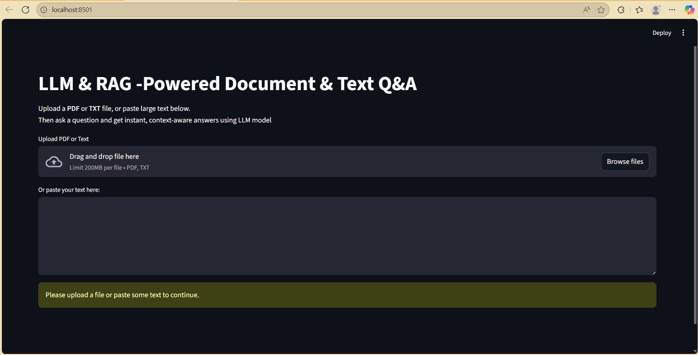
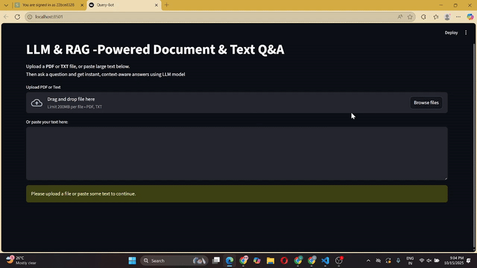

# LLM & RAG -Powered Document & Text Q&A

This is a Streamlit application that allows users to upload a PDF document or Text and ask questions about its content using LLM and RAG-powered. The app uses Langchain, Google gemini model, and HuggingFaceEmbeddings for document retrieval and question answering.

## Requirements

The following libraries are required for this project:

* `langchain-community` >= 0.3.18
* `langchain-huggingface` >= 0.1.2
* `langchain-openai` >= 0.3.7
* `langchain` >= 0.3.19
* `pypdf` >= 5.3.0
* `sentence-transformers` >= 3.4.1
* `streamlit` >= 1.42.2
* `scripts.secret` (for storing your OpenAI API key)
* `scripts.document_loader` (for loading and splitting PDF documents)

You can install the necessary dependencies using pip:

```bash
pip install streamlit langchain faiss
```

## Overview

A powerful open-source Streamlit web app that allows you to:
- Upload **PDF** or **TXT** files
- Paste **large text** manually
- Ask questions about the content
- Get **AI-generated answers** using **Google Gemini** (fast, efficient, context-aware)

## Demonstration

<table>
  <tr>
    <td width="50%"></td>
    <td width="50%"></td>
  </tr>
</table>

## Demo Video

<video src="img/demo.mp4" controls width="80%"></video>


## 🚀 Features
- Supports both **documents** and **text input**
- Uses **FAISS vector search** for efficient retrieval
- Integrated with **Google Gemini 1.5 Flash / 2.5 Flash**
- Clean, minimal **Streamlit UI**
- Ready for **cloud deployment** (Streamlit, Render, or Google Cloud)

---

## 🧠 Tech Stack
- **Frontend/UI:** Streamlit  
- **LLM:** Google Gemini (via `langchain-google-genai`)  
- **Vector Store:** FAISS  
- **Embeddings:** Sentence Transformers  
- **Document Parsing:** LangChain + PyPDF  
- **Language:** Python 3.10+


## How it Works
1. Document Upload
The user can upload a PDF document/text via the Streamlit interface. The file is saved temporarily on the server, and the document is then processed into text chunks for easier retrieval.

2. Text Splitting and Vector Database Creation
Once the document is uploaded:
* The document is loaded and split into smaller chunks to optimize retrieval performance.
* Embeddings (numerical representations of the document's contents) are generated using the OpenAIEmbeddings model.
* A FAISS vector store is created from these embeddings, allowing efficient similarity search.

3. Question-Answering System
The system utilizes a **retrieval-based approach (RAG - Retrieval-Augmented Generation)** to answer user queries.
When a user asks a question, the system retrieves the most relevant chunks from the document using FAISS and processes them with GPT-4 to generate a meaningful answer.

4. User Interface
The application presents:
* An input field to upload the PDF file or text input for entering the text.
* A text box to ask questions about the document.
* Responses generated by the AI based on the content of the document.

## Code Walkthrough

### Imports
The required libraries are imported to handle document processing, vector database creation, and AI-powered responses:

```python
from langchain_community.vectorstores import FAISS
from langchain_openai import OpenAIEmbeddings
from langchain.chains import create_retrieval_chain
from langchain_openai import ChatOpenAI
from langchain.chains.combine_documents import create_stuff_documents_chain
from langchain_core.prompts import ChatPromptTemplate
from scripts.document_loader import load_document
import streamlit as st
```

### Streamlit App Setup
The Streamlit app is initialized, with the title displayed and a file uploader for PDFs.

### Document Processing
When a file is uploaded, the following steps are performed:

* The document is saved temporarily.
* The document is split into chunks using the load_document function.

### Embeddings and Vector Store
Embeddings are generated using OpenAI's model (text-embedding-ada-002), and a FAISS vector store is created to hold these embeddings.

### Question Answering Chain
The question-answering chain is created by combining the retriever (FAISS) and the document processing chain (StuffDocumentsChain). The model used for answering questions is GPT-4.

### User Interaction
The user is prompted to input a question, and the system responds with an answer based on the document's content.


### Running the App
To run the app, execute the following command in your terminal:

```bash
streamlit run app.py
```
This will start the Streamlit server and open the app in your browser.

## 🛠️ Local Setup

### Clone the Repository
```bash
git clone https://github.com/yourusername/QueryBot.git
cd QueryBot
```

# Install Dependencies
```python
pip install -r requirements.txt
```

# Set Up Environment Variables
```python
GOOGLE_API_KEY=your_google_gemini_api_key_here
```

You can get your Gemini API key here:
https://makersuite.google.com/app/apikey

# Run the App
python -m streamlit run app.py


Then open the URL shown in your terminal (usually http://localhost:8501).

---

##  Connect With Me

If you liked this project or found it useful, 
feel free to connect with me on [LinkedIn](https://www.linkedin.com/in/utkarsh2104/) 

---


